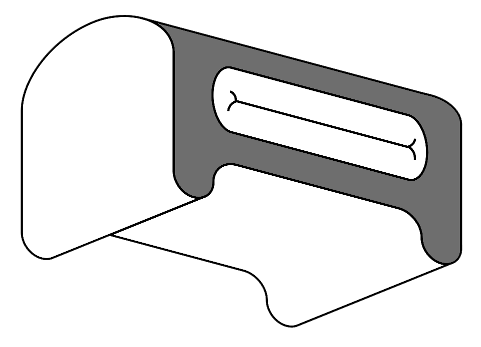
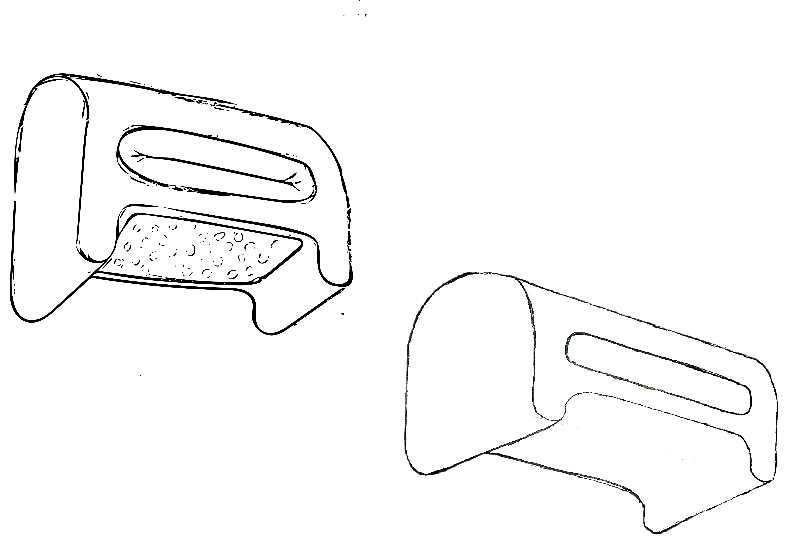

[row][col]

[/col][col]

[/col][col]

[/col][/row]
######Introduction
SID is a footrest which brings the comfort of home into the workplace. It’s a sweet friend with different heights at every orientation to make you feel comfortable in any posture.

######Ideation
As a programmer/ Designer, I spend a lot of time sitting in front of desks, and I always have problem with my feet - Where and How should I put them to make me feel comfortable? I created SID and focused on making it able to satisfy different posture.

######Design

[row][col]

I tried to make a modern-future style office pedestal. After lots of sketchs and tries I found simplicity fits future the most.
[/col][col]

Mono-function, mono-color focus on just one purpose - makes
[/col][/row]

<!--
[row][col]

Lorem ipsum dolor sit amet, consectetur adipisicing elit

[/col][col]

Lorem ipsum dolor sit amet, consectetur adipisicing elit

[/col][col]

Lorem ipsum dolor sit amet, consectetur adipisicing elit

[/col][/row] -->
